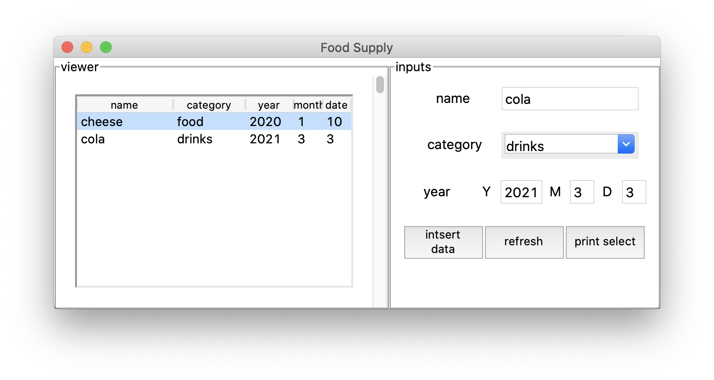

# About This App

This script was used to build a simple tkinter app using Python.

This was built way back in 2017.

Before I became a machine learning engineer, I wanted to know what Python was so I started building this simple but messy Food Management App.

Note, I had no experience with python when building this app but this helped me understand what Python is and how to use it.


## Note

I had built a better of this but could not find it, so I posted this version, which was the most latest.

## Requirements
- sqlite3
- tkinter
- PyQt

## How to Use
```
python example.py
```

## Result


## Reference
http://memopy.hatenadiary.jp/entry/2017/02/12/233121
